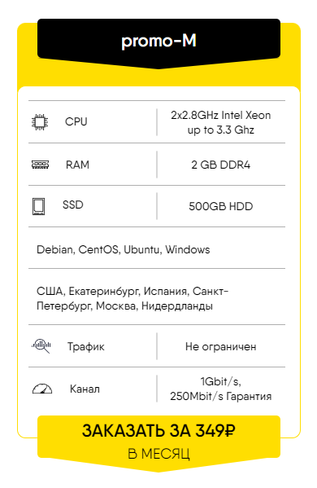
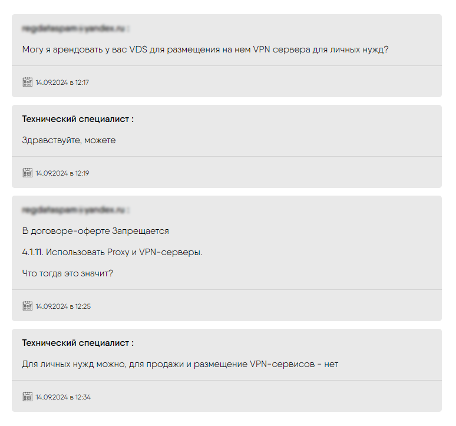
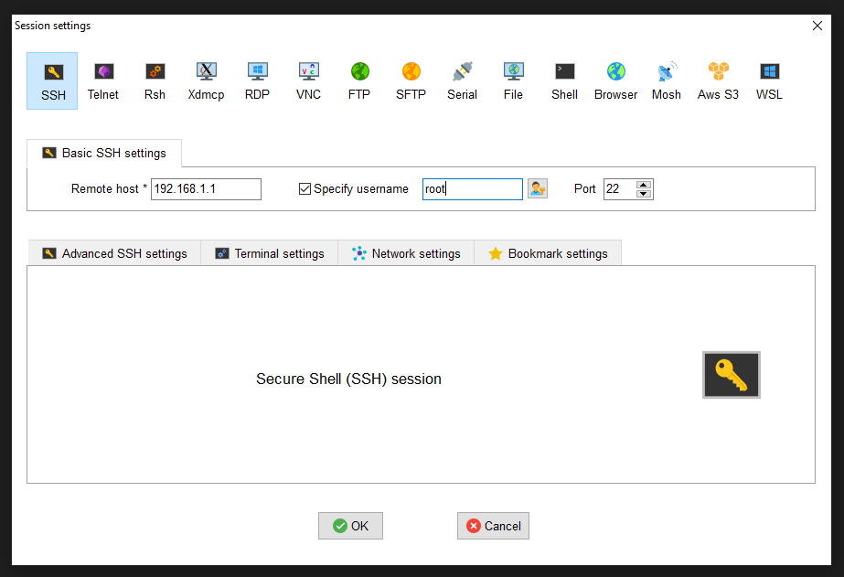
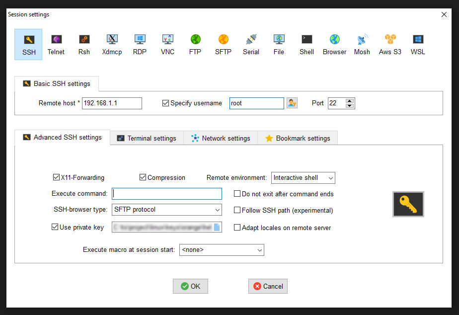
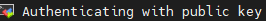
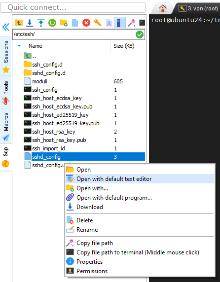
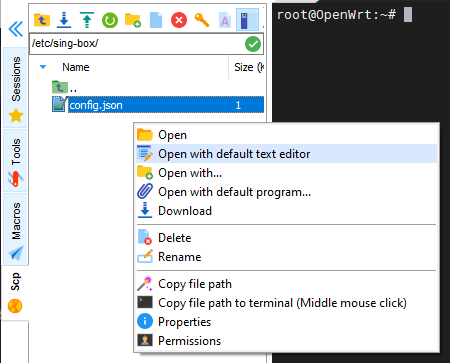

# Установка VPN сервера для обхода блокировок
### Источники
[Обход блокировок: настройка сервера XRay для Shadowsocks-2022 и VLESS с XTLS-Vision, Websockets и фейковым веб-сайтом](https://habr.com/ru/articles/728836/)

[How to Create agit n Xray VLESS XTLS Server on Ubuntu 20.04](https://v2how.github.io/post/2021-02-12-xray-vless-xtls-server-ubuntu-20-04/)

## Хостер сервера
Выбрал сервер у хостера [62YUN](https://62yun.ru/?refid=164653)




Можно платить картой МИР


## Что потребуется
* VDS за пределами РФ. Я выбрал в Нидерландах.
* Доменное имя. К сожалению, бесплатного способа получить доменное имя нет. Я покупал имя у регистратора [рег.ру](https://www.reg.ru/)
* SSH-клиент для подключения. Консоль не очень удобна. Использую [MobaXterm](https://mobaxterm.mobatek.net/download.html).
* Операционная система Linux. Я выбрал Ubuntu 24.04 LTS.

## Настройка сервера

### Настройка ssh-подключения
В MobaXterm создаем новую SSH-сессию

В поле Remote host указываем IP выданный хостером. Посмотреть можно на [странице](https://62yun.ru/servers/index). Отмечаем поле **Specify username** и указываем **root**.
Нажимаем **OK**.

После запуска сессии потребуется ввести пароль, который так же выдает хостер при создании сервера.

* Создаем ssl ключи
```
ssh-keygen
```
После выполнения команды в директории **/root/.ssh/** появится два файла вида **id_<id>** и **id_<id>.pub**
Файл **id_<id>** - это **приватный ключ**. Файл **id_<id>.pub** - это **публичный ключ**. Копируем оба файла себе на машину.

Выполняем комманды в консоли, заменив **ПУБЛИЧНЫЙ_КЛЮЧ** именем файла публичного ключа.
```
cd /root/.ssh
cat ПУБЛИЧНЫЙ_КЛЮЧ > authorized_keys
```

Теперь мы должны иметь возможность подключаться по SSH с приватным ключем.

Закрываем сессию
```
exit
```
В MobaXterm в нашей созданной сессии выбираем **Edit session** и на вкладке **Advanced SSH Settings** указываем
указываем **Use private key** и где находится наш приватный ключ. 


Пробуем зайти на сервер. Если появилась надпись



и мы зашли на сервер, значит будем отключать вход по паролю по SSH.
Открываем файл **/etc/ssh/sshd-config**



Находим в нем строчку

**#PasswordAuthentication yes**

и меняем её на

**PasswordAuthentication no**

Сохраняем файл.

Перезапускаем SSH
```
systemctl restart ssh
```

Теперь с паролем по SSH подключиться будет нельзя.

Отключаемся и пробуем еще раз зайти на сервер)))

## Обновление системы и установка необходимых пакетов

```
apt update && apt upgrade -y
```

### Немного защитим сервер
Установим **fail2ban** и **ipset**
```
apt install fail2ban ipset -y
```
Создаем файл конфигурации
```
cp /etc/fail2ban/jail.conf /etc/fail2ban/jail.local
```
В Action находим строки
```
banaction = iptables-multiport
banaction_allports = iptables-allports
```
и зменяем их на
```
banaction = iptables-ipset-proto6
banaction_allports = iptables-ipset-proto6-allports
```
Создаем файл экшена, чтобы ответ заблокированному ip вообще не отправлялся
```
touch /etc/fail2ban/action.d/iptables-blocktype.local
```
В файл вносим
```
[Init]
blocktype = DROP
```
Перезапускаем fail2ban
```
service fail2ban restart
```

Чтобы посмотреть статус блокировки, например, ssh
```
fail2ban-client status sshd
```

### Устанавливаем **certbot**
```
snap install core
snap refresh core
snap install --classic certbot
```
### Устанавливает **nginx**
```
apt install nginx -y
```
* Конфигурируем фейковый сайт, который будет использоваться для камуфляжа

Открываем файл **/etc/nginx/sites-available/default** и заменяем содержимое на:
```
server {
	listen 127.0.0.1:8080 default_server;
	listen [::1]:8080 default_server;
	root /var/www/html;
	index index.html index.htm index.nginx-debian.html;
	server_name _;
	location / {
		try_files $uri $uri/ =404;
	}
}
```
Здесь 8080 - это порт, который будет слушать **nginx** и выдавать контент в случае неавторизованного доступа к серверу.
Можно повесить что-нибудь бесполезное - фотки котяток и цветочков.
Файлы сайта нужно положить в директорию **/var/www/html**.

*В [архиве](fake-site/html.zip) сайт в котором на странице отображается 1000 фото выбранных случайным образом. Можно его использовать )))*

Перезапускаем **nginx**
```
systemctl restart nginx
```
Проверяем, что с **nginx** все впорядке
```
systemctl status nginx
```

### Устанавливаем XRay
#### Что нам нужно
* SSL-сертификаты для нашего фейкового домена.
Запрашиваем их через **certbot**.
```
certbot certonly --standalone --preferred-challenges http -d example.com -d www.example.com
```
Здесь **example.com** - имя нашего домена.
**Certbot** запросит e-mail, его нужно дать, чтобы, например, в случае невозможности выпуска сертификата или каких-либо других проблем предупредить.

Потом предложит согласиться с его условиями - нужно будет согласиться (Y).

Потом предложит подписаться на рассылку - я отказываюсь (N).

После получения сертификата дописать в конец файла **/etc/letsencrypt/renewal/example.com.conf** строку
```
renew_hook = systemctl reload xray
```
Чтобы после перевыпуска сертификата автоматически перезапускался **XRay**

* SSL-ключ для использования в качестве пароля для **Shadowsocks**
Генерируем его.
```
openssl rand -base64 16
```

* UUID v4 для каждого пользователя, который будет подключаться к **XRay**.

Генерировать можно любым он-лайн генератором (я использовал [этот](https://www.uuidgenerator.net/)), либо установить пакет uuid.
```
apt install uuid
uuid -v 4
```
*Можно использовать один ключ на всех, но удобней каждому пользователю выдать по ключу, который потом можно будет легко удалить.*

* Загадочный ничего не значащий путь, который будет использоваться для конфигурирования **VLESS over Websockets**.

Можно придумать самому, можно использовать он-лайн генератор (я использовал [этот](https://www.random.org/strings/?num=1&len=32&digits=on&loweralpha=on&unique=on&format=html&rnd=new)).

#### Приступаем к установке
* Идем [сюда](https://github.com/XTLS/Xray-core/releases) и выбираем последний релиз. У меня был [1.8.24](https://github.com/XTLS/Xray-core/releases/tag/v1.8.24).
* Копируем адрес ссылки на архив **Xray-linux-64.zip**.
В терминале скачиваем архив
```
wget https://github.com/XTLS/Xray-core/releases/download/v1.8.24/Xray-linux-64.zip
```

```
mkdir /opt/xray
unzip ./Xray-linux-64.zip -d /opt/xray
chmod +x /opt/xray/xray
```

* Создаем юнит
```
touch /usr/lib/systemd/system/xray.service
```
Открываем созданный файл и записываем в него
```
[Unit]
Description=XRay

[Service]
Type=simple
Restart=on-failure
RestartSec=30
WorkingDirectory=/opt/xray
ExecStart=/opt/xray/xray run -c /opt/xray/config.json

[Install]
WantedBy=multi-user.target
```
* Выполняем команды в терминале
```
systemctl daemon-reload
systemctl enable xray
```

### Настраиваем **XRay**
* Создаем файл конфигурации
```
touch /opt/xray/config.json
```
* Окрываем его и записываем
```
{
  "log": {
    "loglevel": "info"
  },
  "routing": {
    "rules": [],
    "domainStrategy": "AsIs"
  },
  "inbounds": [
    {
      "port": 23,
      "tag": "ss",
      "protocol": "shadowsocks",
      "settings": {
        "method": "2022-blake3-aes-128-gcm",
        "password": "<SSL-ключ>",
        "network": "tcp,udp"
      }
    },
    {
      "port": 443,
      "protocol": "vless",
      "tag": "vless_tls",
      "settings": {
        "clients": [
          {
            "id": "<UUID 1>",
            "email": "mobile@<example.com>",
            "flow": "xtls-rprx-vision"
          },
          {
            "id": "<UUID 2>",
            "email": "router@<example.com>",
            "flow": "xtls-rprx-vision"
          },
          {
            "id": "<UUID 3>",
            "email": "laptop@<example.com>",
            "flow": "xtls-rprx-vision"
          },
          {
            "id": "<UUID 4>",
            "email": "tablet@<example.com>",
            "flow": "xtls-rprx-vision"
          }
        ],
        "decryption": "none",
        "fallbacks": [
          {
            "path": "/<Загадочный_ничего_не_значащий_путь>",
            "dest": "@vless-ws"
          },
          {
            "dest": "8080"
          }
        ]
      },
      "streamSettings": {
        "network": "tcp",
        "security": "tls",
        "tlsSettings": {
          "alpn": [
            "http/1.1",
            "h2"
          ],
          "certificates": [
            {
              "certificateFile": "/etc/letsencrypt/live/<example.com>/fullchain.pem",
              "keyFile": "/etc/letsencrypt/live/<example.com>/privkey.pem"
            }
          ]
        }
      },
      "sniffing": {
        "enabled": true,
        "destOverride": [
          "http",
          "tls"
        ]
      }
    },
    {
      "listen": "@vless-ws",
      "protocol": "vless",
      "tag": "vless_ws",
      "settings": {
        "clients": [
          {
            "id": "<UUID 5>",
            "email": "user2@<example.com>"
          }
        ],
        "decryption": "none"
      },
      "streamSettings": {
        "network": "ws",
        "security": "none",
        "wsSettings": {
          "path": "/Загадочный_ничего_не_значащий_путь"
        }
      }
    }
  ],
  "outbounds": [
    {
      "protocol": "freedom",
      "tag": "direct"
    },
    {
      "protocol": "blackhole",
      "tag": "block"
    }
  ]
}
```
Земеняем
**Загадочный_ничего_не_значащий_путь**,
**<example.com>**,
**<UUID 4>**,
**<SSL-ключ>**
своими значениями, полученными ранее.

* Перезапускаем **XRay**
```
systemctl restart xray
```
* Проверяем отсутствие ошибок
```
journalctl -u xray
```

# Настройка на роутере под управлением **OpenWRT** подключения к нашему VPN-серверу и перенаправление трафика к заблокированным ресурсам через VPN

* [Источник](https://github.com/itdoginfo/domain-routing-openwrt/tree/master)

Особая благодарность [Автору](https://github.com/itdoginfo). Благодаря его работе почти все делается автоматически.

На роутере должна быть установлена операционная система **OpenWRT**. И должно быть место для установки пакетов - обычно используют USB флешку, я использовал для этих целей жесткий диск, который подключен к порту USB роутера.

Как выбрать роутер и установить на него **OpenWRT** можно почитать в [блоге](https://itdog.info/kakoj-router-dlya-openwrt-kupit-v-2025-godu/) того же автора.

### Что нужно для продолжения работы

* **VDS сервер** за пределами страны.
* Настроенный на нем **VPN сервер**
* Настроенный доступ по протоколу **shadowsocks**, его будем использовать на роутере.
* Роутер с утановленной **OpenWRT** и подключенный к интернет.

## Устанавливаем на роутер Sing-box

Подключаемся к роутеру по **SSH**

В терминале вводим
```
sh <(wget -O - https://raw.githubusercontent.com/itdoginfo/domain-routing-openwrt/master/getdomains-install.sh)
```
В процессе работы скрипта отвечаем на вопросы:

* На запрос выбора тунеля выбираем **Sing-box**: 3
* На запрос выбора приложения шифрования DNS запросов пока выбираем **No**: 1
* На запрос выбора страны выбираем **Russia inside**: 1

### Настройка Sing-box

Открываем файл **/etc/sing-box/config.json**



И вносим данные нашего **vpn-сервера**
```
{
  "log": {
    "level": "debug"
  },
  "inbounds": [
    {
      "type": "tun",
      "interface_name": "tun0",
      "domain_strategy": "ipv4_only",
      "inet4_address": "172.16.250.1/30",
      "auto_route": false,
      "strict_route": false,
      "sniff": true 
   }
  ],
  "outbounds": [
    {
      "type": "shadowsocks",
      "server": "<ИМЯ ДОМЕНА>",
      "server_port": <ПОРТ>,
      "method": "<МЕТОД ШИФРОВАНИЯ>",
      "password": "<ПАРОЛЬ>"
    }
  ],
  "route": {
    "auto_detect_interface": true
  }
}
```
Проверяем:
* **"inet4_address": "172.16.250.1/30"** - не совпадает не с одним диапазоном настроенной локальной сети.
* **<ИМЯ ДОМЕНА>** указываем имя нашего домена vpn-сервера. *Берется из файла **/opt/xray/config.json** из раздела **inbounds**, где описан протокол **shadowsocks**.*
* **<ПОРТ>** - порт на котором работает **shadowsocks**. *Берется из файла **/opt/xray/config.json** из раздела **inbounds**, где описан протокол **shadowsocks**.*
* **<МЕТОД ШИФРОВАНИЯ>** - метод шифрования. *Берется из файла **/opt/xray/config.json** из раздела **inbounds**, где описан протокол **shadowsocks**.*
* **<ПАРОЛЬ>** - пароль. *Берется из файла **/opt/xray/config.json** из раздела **inbounds**, где описан протокол **shadowsocks**.*

Перезапускаем **sing-box**
```
service sing-box restart
```
Теперь трафик до заблокированных сайтов должен ходить через **vpn-сервер**, а весь остальной через местного провайдера.

## Устанавливаем на роутер шифрование DNS-запросов

*Шифрование DNS-запросов необходимо для получения правильного **ip-адреса**, если провайдер перехватывает DNS-запросы и вместо правильного **ip-адреса** выдает фейковый.*

Запускаем вновь скрипт
```
sh <(wget -O - https://raw.githubusercontent.com/itdoginfo/domain-routing-openwrt/master/getdomains-install.sh)
```
* На запрос выбора тунеля выбираем **Skip this step**: 5
* На запрос выбора приложения шифрования DNS выбираем **Stubby**: 3
* На запрос выбора страны выбираем **Skip script creation**: 4

## Клиент для Android и Windows
Клиентов для подключения к **vpn-серверам** великое множество. Можно выбрать любой.
Мне понравился [NekoBox](https://github.com/MatsuriDayo/NekoBoxForAndroid/releases).

На момент написания последний резиз был **1.2.9** доступен для скачивания на [странице](https://github.com/MatsuriDayo/NekoBoxForAndroid/releases/tag/1.2.9).
Выбираем нужную платформу, скачиваем и запускаем.

### Как определить нужную платформу

Открываем на Android-устройстве Telegram, заходим в **Настройки**, проматываем меню вниз, в самом низу видим строку вида
```
Telegram для Android v11.1.3(5244) store bundled arm64-v8a
```
**arm64-v8a** - это то что мне нужно )))

Приложение простое, интуитивно понятное. Нужды описывать настройку не вижу.

*Все данные для подключения протоколов берутся из файла **/opt/xray/config.json** из раздела **inbounds**, где описан протокол **shadowsocks**.*

*Можно облегчить себе жизнь, установив программу на PC, настроив подключения, а затем поделиться с мобильным устройством настройками через **QR-код**.*

### Как добавить сайты в список
Если нужно добавить сайт в список, нужно посмотреть в браузере куда отправляет запросы недоступная страница.

Нужно попытаться загрузить страницу, после в консоли браузера выполнить команду
```
console.log(["config ipset\nlist name 'vpn_domains'"].concat([...new Set(performance.getEntriesByType('resource').map(r => (new URL(r.name).hostname)))].map(res => (`list domain '${res}'`))).join('\n'));

```
В консоли будет список всех доменов, к которым обращалась страница. Возможно, какие-то домены уже есть в списке, а какие-то не нужны. Нужно сравнить домены с теми, что храняться в файле **/tmp/dnsmasq.d/domains.lst**
и внести в файл **/etc/config/dhcp** в том виде, который получится в консоли.

### Очистка DNS-кэша
В Windows в коммандной сроке ввести
```
ipconfig /flushdns
```
Всем добра и удачи
