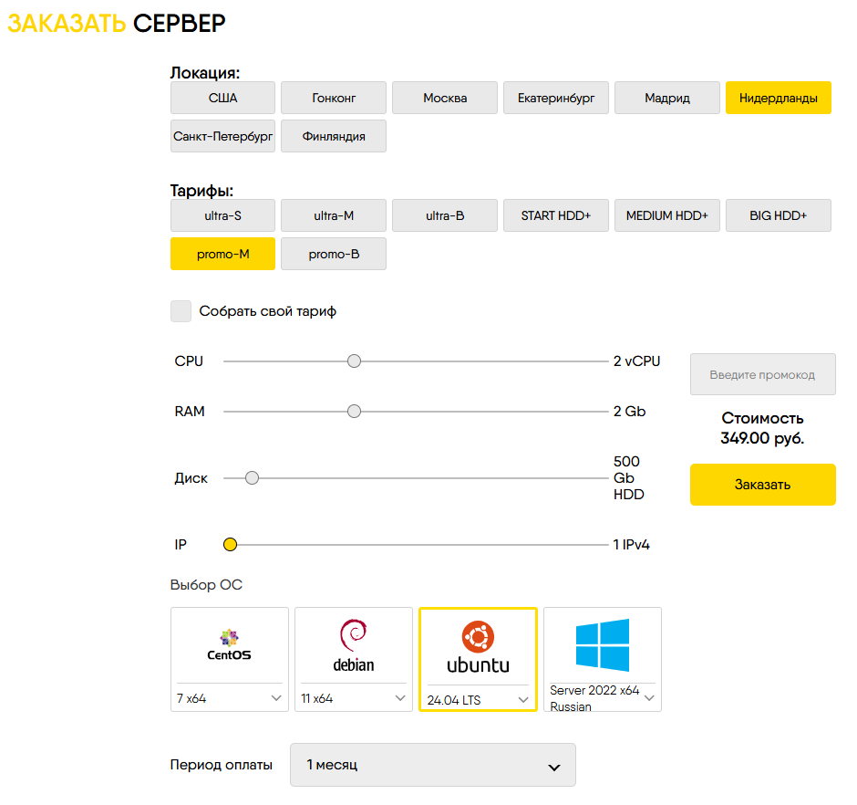
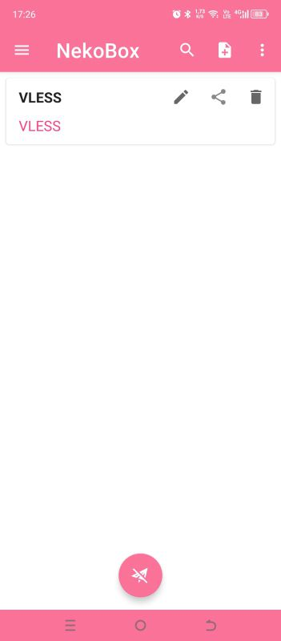

# Установка VPN сервера
## Содержание
1. [Что потребуется](#whatNeeds)
1. [Выбор хостинга и конфигурация сервера](#hoster)
    - [Создание сервера](#create-server)
1. [Настройка сервера](#setup-server)
    - [Настройка ssh-подключения](#setup-ssh)
    - [Обновление системы и установка необходимых пакетов](#update-system-install-packets)
      - [Защита сервера](#fail2ban)
      - [Установка Certbot](#certbot)
      - [Установка NGINX](#nginx)
      - [Установка XRay](#xray)
        - [Предварительная подготовка](#xray-what-needs)
        - [Установка](#xray-install)
        - [Настройка](#xray-setup)
    - [Добавление ежедневной перезагрузки сервера](#server-restart)
1. [Настройка клиентов для подключения к серверу](#clients)
    - [Установка и настройка клиента для Windows](#clients-windows)
        - [Установка и запуск NekoBox](#clients-windows-install)
        - [Настройка NekoBox](#clients-windows-setup)
          - [Настройка подключений](#clients-windows-setup-servers)
            - [Настройка профиля подключения типа Shadowsocks](#clients-windows-setup-servers-shadowsocks)
            - [Настройка профиля подключения типа VLESS](#clients-windows-setup-servers-vless)
            - [Настройка профиля подключения типа VLESS over Websocket](#clients-windows-setup-servers-vless)
          - [Настройка фильтрации трафика в NekoBox](#clients-windows-setup-routes)
    - [Установка и настройка клиент для Android](#clients-android)
        - [установка](#clients-android-install)
          - [Как определить платформу](#clients-android-platform-detect)
        - [Настройка подключений](#clients-android-setup)
          - [Настройка подключений](#clients-android-setup-connections)
        - [Настройка маршрутизации трафика](#clients-android-setup-routes)
   - [Установка и настройка на роутере под управлением **OpenWRT** подключения к нашему VPN-серверу и перенаправление трафика к заблокированным ресурсам через VPN](#clients-openwrt)
       - [Установка на роутер Podkop](#clients-openwrt-podkop-setup)
       - [Добавляем ежедневную перезагрузку роутера](#clients-openwrt-server-restart)
       - [Как добавить сайты в список](#clients-openwrt-add-domains-to-list)
1. [Как очистить DNS-кэш в Windows](#windows-dns-cash-clean)
1. [Что еще можно поставить на этот сервер](#add-more)


### Источники
[Обход блокировок: настройка сервера XRay для Shadowsocks-2022 и VLESS с XTLS-Vision, Websockets и фейковым веб-сайтом](https://habr.com/ru/articles/728836/)

[How to Create agit n Xray VLESS XTLS Server on Ubuntu 20.04](https://v2how.github.io/post/2021-02-12-xray-vless-xtls-server-ubuntu-20-04/)

<a name="whatNeeds">

## Что потребуется
* VDS за пределами РФ. Я выбрал в Нидерландах.
* Доменное имя. К сожалению, бесплатного способа получить доменное имя нет. Я покупал имя у регистратора [рег.ру](https://www.reg.ru/)

<a name="hoster">

## Хостер сервера

Выбрал сервер у хостера [62YUN](https://62yun.ru/?refid=164653)


Можно платить картой МИР


<a name="create-server">

## Создание сервера

После пополнения баланса в соответствии с выбранным тарифом переходим на страницу [Мои серверы](https://62yun.ru/servers/index).
Нажимаем кнопку **Заказать Сервер**.

Выбираем:
- [x] Локация: Нидерланды
- [x] Тарифы: Promo-M
- [x] Выбор ОС: Ubuntu 24.04 LTS
- [x] Период оплаты: 1 месяц
- [x] Заказать



<a name="setup-server">

## Настройка сервера

<a name="setup-ssh">

### Настройка ssh-подключения

Для подключения к удаленному серверу есть много разных клиентов я буду использовать клиент **MobaXterm**.
Бесплатную версию можно скачать на официальном [сайте](https://mobaxterm.mobatek.net/download.html).

В MobaXterm создаем новую SSH-сессию


В поле Remote host указываем IP выданный хостером. Посмотреть можно на [странице](https://62yun.ru/servers/index). Отмечаем поле **Specify username** и указываем **root**.
Нажимаем **OK**.

После запуска сессии потребуется ввести пароль, который так же выдает хостер при создании сервера.

* Создаем ssl ключи
```
ssh-keygen
```
После выполнения команды в директории **/root/.ssh/** появится два файла вида **id_<id>** и **id_<id>.pub**
Файл **id_<id>** - это **приватный ключ**. Файл **id_<id>.pub** - это **публичный ключ**. Копируем оба файла себе на машину.

Выполняем комманды в консоли, заменив **ПУБЛИЧНЫЙ_КЛЮЧ** именем файла публичного ключа.
```
cd /root/.ssh
cat ПУБЛИЧНЫЙ_КЛЮЧ > authorized_keys
```

Установим правильные разрешения
```
chown -R root:root /root/.ssh
chmod 600 /root/.ssh/authorized_keys
chmod 700 /root/.ssh
```

Теперь мы должны иметь возможность подключаться по SSH с приватным ключом.

Закрываем сессию
```
exit
```
В MobaXterm в нашей созданной сессии выбираем **Edit session** и на вкладке **Advanced SSH Settings** указываем
указываем **Use private key** и где находится наш приватный ключ. 


Пробуем зайти на сервер. Если появилась надпись


и мы зашли на сервер, значит будем отключать вход по паролю по SSH.
Открываем файл **/etc/ssh/sshd-config**


Находим в нем строчку

**#PasswordAuthentication yes**

и меняем её на

**PasswordAuthentication no**

Сохраняем файл.

Перезапускаем SSH
```
systemctl restart ssh
```

Теперь с паролем по SSH подключиться будет нельзя.

Отключаемся и пробуем еще раз зайти на сервер)))

<a name="update-system-install-packets">

## Обновление системы и установка необходимых пакетов

```
apt update && apt upgrade -y
```

<a name="fail2ban">

### Немного защитим сервер

Установим **fail2ban** и **ipset**

```
apt install fail2ban ipset -y
```

Создаем файл конфигурации

```
cp /etc/fail2ban/jail.conf /etc/fail2ban/jail.local
```
В файле **/etc/fail2ban/jail.local** в разделе **Action** находим строки
```
banaction = iptables-multiport
banaction_allports = iptables-allports
```
и зменяем их на
```
banaction = iptables-ipset-proto6
banaction_allports = iptables-ipset-proto6-allports
```
Создаем файл экшена, чтобы ответ заблокированному ip вообще не отправлялся
```
touch /etc/fail2ban/action.d/iptables-blocktype.local
```
В файл вносим
```
[Init]
blocktype = DROP
```

Перезапускаем fail2ban

```
service fail2ban restart
```

Чтобы посмотреть статус блокировки, например, ssh

```
fail2ban-client status sshd
```
<a name="certbot">

### Устанавливаем **certbot**

```
snap install core
snap refresh core
snap install --classic certbot
```

<a name="nginx">

### Устанавливаем **nginx**
```
apt install nginx-full -y
```
* Конфигурируем фейковый сайт, который будет использоваться для камуфляжа

Открываем файл **/etc/nginx/sites-available/default** и заменяем содержимое на:
```
server {
	listen 127.0.0.1:8080 default_server;
	listen [::1]:8080 default_server;
	root /var/www/html;
	index index.html index.htm index.nginx-debian.html;
	server_name _;
	location / {
		try_files $uri $uri/ =404;
	}
}
```
Здесь 8080 - это порт, который будет слушать **nginx** и выдавать контент в случае неавторизованного доступа к серверу.
Можно повесить что-нибудь бесполезное - фотки котяток и цветочков.
Файлы сайта нужно положить в директорию **/var/www/html**.

*В [архиве](fake-site/html.zip) сайт в котором на странице отображается 1000 фото выбранных случайным образом. Можно его использовать )))*

В файл ``/etc/nginx/nginx.conf`` внесем изменения

```
user www-data;
worker_processes auto;
pid /run/nginx.pid;
error_log /var/log/nginx/error.log;
include /etc/nginx/modules-enabled/*.conf;

events {
	worker_connections 768;
}

http {
	sendfile on;
	tcp_nopush on;
	types_hash_max_size 2048;
	include /etc/nginx/mime.types;
	default_type application/octet-stream;
	ssl_protocols TLSv1 TLSv1.1 TLSv1.2 TLSv1.3;
	ssl_prefer_server_ciphers on;
	access_log /var/log/nginx/access.log;
	gzip on;
	include /etc/nginx/conf.d/*.conf;
	include /etc/nginx/sites-enabled/*;
 
  client_body_timeout 12;
  client_header_timeout 12;
  keepalive_timeout 15;
  send_timeout 10;
}

stream {
  upstream xray_backend {
    server 127.0.0.1:8443;
  }
  
  upstream domain_backend {
    server 127.0.0.1:444;
  }
  
  map $ssl_preread_server_name $backend {
    default                       xray_backend;
  }
  
  server {
    listen 443;
    proxy_pass $backend;
    ssl_preread on;
  }
}
```

*Небольшие пояснения*

**Nginx** будет слушать 443 порт, трафик, предназначенный для будущих доменов
и сервисов будет перенаправлять на 444 порт, а весь остальной трафик будет
отдавать **xray**.

Сейчас, пока нет других доменов и сервисов, весь трафик будет идти в **xray**.

Перезапускаем **nginx**

```
systemctl restart nginx
```

Проверяем, что с **nginx** все в порядке

```
systemctl status nginx
```

<a name="xray">

### Устанавливаем XRay

<a name="xray-what-needs">

#### Что нам нужно

* SSL-сертификаты для нашего фейкового домена.

Проверяем, что 80 порт свободен
```
ss -tuln
```
Запрашиваем их через **certbot**.

```
certbot certonly --standalone --preferred-challenges http -d example.com -d www.example.com
```
Здесь **example.com** - имя нашего домена.
**Certbot** запросит e-mail, его нужно дать, чтобы, например, в случае невозможности выпуска сертификата или каких-либо других проблем предупредить.

Потом предложит согласиться с его условиями - нужно будет согласиться (Y).

Потом предложит подписаться на рассылку - я отказываюсь (N).

После получения сертификата дописать в конец файла **/etc/letsencrypt/renewal/example.com.conf** строку
```
renew_hook = systemctl reload xray
```
Чтобы после перевыпуска сертификата автоматически перезапускался **XRay**

* SSL-ключ для использования в качестве пароля для **Shadowsocks**
Генерируем его.
```
openssl rand -base64 16
```

* UUID v4 для каждого пользователя, который будет подключаться к **XRay**.

Генерировать можно любым он-лайн генератором (я использовал [этот](https://www.uuidgenerator.net/)), либо установить пакет uuid.
```
apt install uuid
uuid -v 4
```
*Можно использовать один ключ на всех, но удобней каждому пользователю выдать по ключу, который потом можно будет легко удалить.*

* Загадочный ничего не значащий путь, который будет использоваться для конфигурирования **VLESS over Websockets**.

Можно придумать самому, можно использовать он-лайн генератор (я использовал [этот](https://www.random.org/strings/?num=1&len=32&digits=on&loweralpha=on&unique=on&format=html&rnd=new)).

<a name="xray-install">

#### Приступаем к установке

* Идем [сюда](https://github.com/XTLS/Xray-core/releases) и выбираем последний релиз. У меня был [1.8.24](https://github.com/XTLS/Xray-core/releases/tag/v1.8.24).
* Копируем адрес ссылки на архив **Xray-linux-64.zip**.
В терминале скачиваем архив
```
wget https://github.com/XTLS/Xray-core/releases/download/v1.8.24/Xray-linux-64.zip
```

```
mkdir /opt/xray
unzip ./Xray-linux-64.zip -d /opt/xray
chmod +x /opt/xray/xray
```

* Создаем юнит
```
touch /usr/lib/systemd/system/xray.service
```
Открываем созданный файл и записываем в него
```
[Unit]
Description=XRay

[Service]
Type=simple
Restart=on-failure
RestartSec=30
WorkingDirectory=/opt/xray
ExecStart=/opt/xray/xray run -c /opt/xray/config.json

[Install]
WantedBy=multi-user.target
```
* Выполняем команды в терминале
```
systemctl daemon-reload
systemctl enable xray
```

<a name="xray-setup">

### Настраиваем **XRay**
* Создаем файл конфигурации
```
touch /opt/xray/config.json
```
* Открываем его и записываем
```
{
  "log": {
    "loglevel": "info"
  },
  "routing": {
    "rules": [],
    "domainStrategy": "AsIs"
  },
  "inbounds": [
    {
      "port": 23,
      "tag": "ss",
      "protocol": "shadowsocks",
      "settings": {
        "method": "2022-blake3-aes-128-gcm",
        "password": "<SSL-ключ>",
        "network": "tcp,udp"
      }
    },
    {
      "port": 8443,
      "protocol": "vless",
      "tag": "vless_tls",
      "settings": {
        "clients": [
          {
            "id": "<UUID 1>",
            "email": "mobile@<example.com>",
            "flow": "xtls-rprx-vision"
          },
          {
            "id": "<UUID 2>",
            "email": "router@<example.com>",
            "flow": "xtls-rprx-vision"
          },
          {
            "id": "<UUID 3>",
            "email": "laptop@<example.com>",
            "flow": "xtls-rprx-vision"
          },
          {
            "id": "<UUID 4>",
            "email": "tablet@<example.com>",
            "flow": "xtls-rprx-vision"
          }
        ],
        "decryption": "none",
        "fallbacks": [
          {
            "path": "/<Загадочный_ничего_не_значащий_путь>",
            "dest": "@vless-ws"
          },
          {
            "dest": "8080"
          }
        ]
      },
      "streamSettings": {
        "network": "tcp",
        "security": "tls",
        "tlsSettings": {
          "alpn": [
            "http/1.1",
            "h2"
          ],
          "certificates": [
            {
              "certificateFile": "/etc/letsencrypt/live/<example.com>/fullchain.pem",
              "keyFile": "/etc/letsencrypt/live/<example.com>/privkey.pem"
            }
          ]
        }
      },
      "sniffing": {
        "enabled": true,
        "destOverride": [
          "http",
          "tls"
        ]
      }
    },
    {
      "listen": "@vless-ws",
      "protocol": "vless",
      "tag": "vless_ws",
      "settings": {
        "clients": [
          {
            "id": "<UUID 5>",
            "email": "user2@<example.com>"
          }
        ],
        "decryption": "none"
      },
      "streamSettings": {
        "network": "ws",
        "security": "none",
        "wsSettings": {
          "path": "/Загадочный_ничего_не_значащий_путь"
        }
      }
    }
  ],
  "outbounds": [
    {
      "protocol": "freedom",
      "tag": "direct"
    },
    {
      "protocol": "blackhole",
      "tag": "block"
    }
  ]
}
```
Заменяем
**Загадочный_ничего_не_значащий_путь**,
**<example.com>**,
**<UUID 4>**,
**<SSL-ключ>**
своими значениями, полученными ранее.

* Перезапускаем **XRay**
```
systemctl restart xray
```
* Проверяем отсутствие ошибок
```
journalctl -u xray
```

<a name="server-restart">

### Добавим ежедневный рестарт сервера

Добавим задачу в **cron**
```
crontab -e
```
Добавим строку в конец файла
```
0 21 * * * /usr/sbin/reboot
```
Будем перегружать сервер ежедневно в 21:00 нидерландского времени.

Сохраняем изменения **Ctrl+O**, **Enter**

Выходим **Ctrl+X**

<a name="clients">

# Настройка клиентов для подключения к серверу

Сначала настроим клиент для **Windows**, проверим его работу со всеми подключениями, затем используя уже готовые конфигурации подключений,
выполним установку и настройку клиентов для **Android** и для роутера, работающего на **OpenWRT**

<a name="clients-windows">

## Установка и настройка клиента для Windows

<a name="clients-windows-install">

### Установка и запуск NekoBox

Переходим на [страницу](https://github.com/Matsuridayo/nekoray/releases) и находим релиз с пометкой *Latest*. На момент написания это был 4.0.1


Проматываем ниже до раздела *Assets* и скачиваем программу для своей платформы


После скачивания разархивируем полученный архив. Запускаем файл *nekobox.exe*


После запуска брандмауэр скажет, что заблокировал связь для *nekobox*. Нужно будет разрешить использование в
- [x] *частных*
- [x] *общественных* сетях 


Возможно, что перед запуском *nekoray* потребует установку дополнительных библиотек. Лежат они [здесь](https://aka.ms/vs/17/release/vc_redist.x64.exe).  

<a name="clients-windows-setup">

### Настройка NekoBox

<a name="clients-windows-setup-servers">

#### Настройка подключений

<a name="clients-windows-setup-servers-shadowsocks">

##### Настройка профиля подключения типа Shadowsocks

Нажимаем кнопку *Сервер* и выбираем *Новый профиль* 


В открывшемся окне настраиваем доступ к нашему серверу
* Тип - **Shadowsocks**
* Имя - придумываем какое-нибудь осмысленное название для нашего подключения, например, **ShadowSocks2022**
* Адрес - здесь указываем ip-адрес нашего сервера, который выдал нам хостер.
* Порт - 23.
* Шифрование - выбираем **2022-blake3-aes-128-gcm**
* Указываем пароль для доступа к нашему сервису, который мы указывали в файле **/etc/sing-box/config.json**
* Нажимаем **ОК**
```
...
    {
      "type": "shadowsocks",
      "server": "<ИМЯ ДОМЕНА>",
      "server_port": <ПОРТ>,
      "method": "<МЕТОД ШИФРОВАНИЯ>",
      "password": "<ПАРОЛЬ>"
    }
...
```


Подключение создано. Теперь проверим его.

Сначала запустим. Правой кнопкой мыши кликаем на соединение и выбираем **Запустить**


Теперь проверим. Правой кнопкой мыши кликаем на соединение и выбираем **Текущий выбор -> Url Test**


Внизу в **Журнале** смотрим результаты тестов.

<a name="clients-windows-setup-servers-vless">

##### Настройка профиля подключения типа VLESS

Аналогично добавляем профиль **VLESS**, подставляя свои значения из файла конфигурации **xray**.


Также проверяем профиль.

<a name="clients-windows-setup-servers-vless-over-websockets">

##### Настройка профиля подключения типа VLESS over Websockets

Аналогично добавляем профиль **VLESS over Websocket**, подставляя свои значения из файла конфигурации **xray**.


Также проверяем профиль.


Если ошибок нет, включаем **NekoBox** в режим системного прокси.

**Программа -> Режим системного прокси -> Активировать системный прокси**


Всё! Можем сходить на [сайт](https://2ip.ru), проверить наш ip адрес.

Сервис должен показать, что вы Нидерландах.


<a name="clients-windows-setup-routes">

### Настройка фильтрации трафика в NekoBox

Заходим в **Настройки** -> **Настройки маршрутов**


Добавляем в **Базовые маршруты**

в **IP** - **Напрямую**

```
geoip:ru
geoip:private
```

в **Домен** - **Напрямую**

```
domain:ru
```

**Outbound по-умолчанию** ставим в значение **proxy**


Проверяем, что фильтрация работает.

Заходим на сайт [2ip.ru/](https://2ip.ru/) - должен показать российский ip.

Заходим на сайт [whoer.net](https://whoer.net/ru) - должен показать нидерландский ip.

<a name="clients-android">

## Клиент для Android

На момент написания последний релиз был **1.2.9** доступен для скачивания на [странице](https://github.com/MatsuriDayo/NekoBoxForAndroid/releases/tag/1.2.9).
Выбираем нужную платформу, скачиваем и запускаем.

<a name="clients-android-install">

### Установка NekoBox для Android

<a name="clients-android-platform-detect">

#### Как определить нужную платформу

Открываем на Android-устройстве Telegram, заходим в **Настройки**, проматываем меню вниз, в самом низу видим строку вида
```
Telegram для Android v11.1.3(5244) store bundled arm64-v8a
```
**arm64-v8a** - это то что мне нужно )))


- Скачиваем на свой телефон программу.
- Устанавливаем. Возможно, нужно будет включить возможность установки из других источников.
- Запускаем программу.
- Приступаем к настройке.

<a name="clients-android-setup">

### Настройка NekoBox для Android

<a name="clients-android-setup-connections">

#### Настройка подключений

В клиенте **NekoBox для Windows** выделяем сервер правой кнопкой мыши и выбираем **Поделиться -> QR-код и ссылка**.
Либо просто выбираем сервер и нажимаем **Ctrl+Q**.


Появится окно с QR-кодом и ссылка для подключения.

В клиенте **NekoBox для Android** добавляем сервер


И выбираем **Отсканировать QR-код**. Наводим камеру на монитор компьютера. Подключение добавится.



Добавляем аналогично все остальные подключениями.

<a name="clients-android-setup-routes">

#### Настройка маршрутизации трафика

Добавим пару правил маршрутизации. Будем направлять трафик на сайты в зоне **ru** и сайты с российскими **ip** адресами напрямую через провайдера.

Переходим в **Маршруты**


Добавляем маршрут


- В **Название маршрута** пишем что-то понятное для нас, я пишу **Имя домена RU**.
- В **Настройках маршрута** в **domain** записываем значение **domain:ru**.
- В **outbound** выбираем правило **Обход**.
- Нажимаем **✔️** для подтверждения изменений маршрута.


Добавим еще один маршрут

- В **Название маршрута** пишем что-то понятное для нас, я пишу **IP адрес RU**.
- В **Настройках маршрута** в **ip** записываем значение **geoip:ru**.
- В **outbound** выбираем правило **Обход**.
- Нажимаем **✔️** для подтверждения изменений маршрута.


Теперь включим оба новых маршрута


Переходим в **Конфигурации** и перезапускаем подключение.

Идем на сайт [2ip.ru](https://2ip.ru) - видим, что наш ip адрес определен как российский.

Идем на сайт [whoer.net](https://whoer.net) - видим, что наш ip адрес определен как нероссийский.

Значит трафик до российских сайтов идет напрямую через провайдера, а трафик до зарубежных сайтов идет через **vpn**.

<a name="clients-openwrt">

## Настройка на роутере под управлением **OpenWRT** подключения к нашему VPN-серверу и перенаправление трафика к заблокированным ресурсам через VPN

* [Источник](https://podkop.net/)

Особая благодарность [Автору](https://github.com/itdoginfo). Благодаря его работе почти все делается автоматически.

На роутере должна быть установлена операционная система **OpenWRT**.

Как выбрать роутер и установить на него **OpenWRT** можно почитать в [блоге](https://itdog.info/kakoj-router-dlya-openwrt-kupit-v-2025-godu/) того же автора.

Я установил все на роутер **Xiaomi Mi Router AX3000T**


Можно поискать такой и на других площадках.

### Что нужно для продолжения работы

* **VDS сервер** за пределами страны (у нас такой уже есть).
* Настроенный на нем **VPN сервер**
* Роутер с установленной **OpenWRT** и подключенный к интернету.

<a name="clients-openwrt-podkop-setup">

### Устанавливаем на роутер Podkop

Подключаемся к роутеру по **SSH**

В терминале вводим
```
sh <(wget -O - https://raw.githubusercontent.com/itdoginfo/podkop/refs/heads/main/install.sh)
```
В процессе установки отвечаем на вопросы, если захочется, можно поставить
русский интерфейс в **LuCI**, я не стал его устанавливать.

Заходим на роутер с компьютера в домашней сети.
После установки **podkop** должен появится в меню **Services** пункт **Podkop**.


В настройках устанавливаем параметры своего сервера


В поле **Proxy Confuguration URL** указываем vless-ссылку (копируем из NekoBox).
Можно указать в комментариях и другие ссылки, чтобы в случае аварии
раскомментировать и использовать другую ссылку на подключение.

В поле **User Domains List** указываем свои домены, которые должны посещаться
через прокси.

Нажимаем **Save & Apply**.

В браузере компьютера, подключенного к роутеру, идем на
[страницу](https://whoer.net/ru) и убеждаемся, что ваш ip не российский. 


<a name="clients-openwrt-server-restart">

## Добавляем ежедневную перезагрузку роутера

Подключаемся к роутеру по **ssh**. В консоли выполняем

```
crontab -e
```

Добавляем строчку
```
0 4 * * * sleep 70 && touch /etc/banner && reboot
```
Роутер будет перегружаться ежедневно в 04:00

<a name="clients-openwrt-add-domains-to-list">

## Как добавить сайты в список

Если нужно добавить сайт в список, нужно посмотреть в браузере куда отправляет запросы недоступная страница.

Нужно попытаться загрузить страницу, после в консоли браузера выполнить команду

```
console.log([...new Set(performance.getEntriesByType('resource').map(r => (new URL(r.name).hostname)))].map(res => (`${res}`)).join(',\n'));
```

В консоли будет список всех доменов, к которым обращалась страница.
Возможно, какие-то домены уже есть в списке, а какие-то не нужны.
Нужно сравнить имена доменов с теми, что указаны в поле **User Domains List**
и внести в поле недостающие.

Нажимаем **Save & Apply**.

<a name="windows-dns-cash-clean">

# Очистка DNS-кэша
В Windows в командной строке ввести

```
ipconfig /flushdns
```
<a name="add-more">

# Что еще можно установить на этот сервер

Можно на этот сервер поставить:
* Личное файловое хранилище [**Seafile**](https://github.com/margazun/vds-seafile-server)
* Личный сервер для удаленного управления клиентами [**RustDesk**](https://github.com/margazun/2025-rustdesk-server),
взамен **TeamViewer** и **AnyDesk**

Всем добра и удачи
