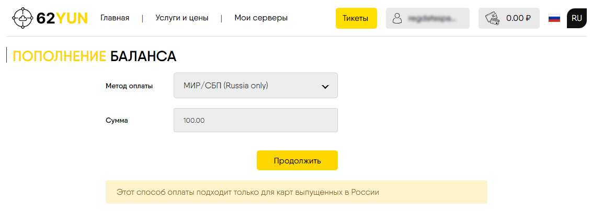

# Установка VPN сервера для обхода блокировок
### Источники
[Обход блокировок: настройка сервера XRay для Shadowsocks-2022 и VLESS с XTLS-Vision, Websockets и фейковым веб-сайтом](https://habr.com/ru/articles/728836/)

[How to Create an Xray VLESS XTLS Server on Ubuntu 20.04](https://v2how.github.io/post/2021-02-12-xray-vless-xtls-server-ubuntu-20-04/)

## Хостер сервера
Выбрал сервер у хостера [62YUN](https://62yun.ru/index)


Можно платить картой МИР


## Что потребуется
* VDS за пределами РФ. Я выбрал в Нидерландах.
* Доменное имя. К сожалению, бесплатного способа получить доменное имя нет. Я покупал имя у регистратора [рег.ру](https://www.reg.ru/)
* SSH-клиент для подключения. Консоль не очень удобна. Использую [MobaXterm](https://mobaxterm.mobatek.net/download.html).
* Операционная система Linux. Я выбрал Ubuntu 24.04 LTS.

## Настройка сервера

### Настройка ssh-подключения
В MobaXterm создаем новую SSH-сессию

В поле Remote host указываем IP выданный хостером. Посмотреть можно на [странице](https://62yun.ru/servers/index). Отмечаем поле **Specify username** и указываем **root**.
Нажимаем **OK**.

После запуска сессии потребуется ввести пароль, который так же выдает хостер при создании сервера.

* Создаем ssl ключи
```
ssh-keygen
```
После выполнения команды в директории **/root/.ssh/** появится два файла вида **id_<id>** и **id_<id>.pub**
Файл **id_<id>** - это **приватный ключ**. Файл **id_<id>.pub** - это **кубличный ключ**. Копируем оба файла себе на машину.

Выполняем комманды в консоли, заменив **ПУБЛИЧНЫЙ_КЛЮЧ** именем файла публичного ключа.
```
cd /root/.ssh
cat ПУБЛИЧНЫЙ_КЛЮЧ > authorized_keys
```

Теперь мы должны иметь возможность подключаться по SSH с приватным ключем.

Закрываем сессию
```
exit
```
В MobaXterm в нашей созданной сессии выбираем **Edit session** и на вкладке **Advanced SSH Settings** указываем
указываем **Use private key** и где находится наш приватный ключ. 


Пробуем зайти на сервер. Если появилась надпись


и мы зашли на сервер, значит будем отключать вход по паролю по SSH.
Открываем файл **/etc/ssh/sshd-config**


Находим в нем строчку

**#PasswordAuthentication yes**

и меняем её на

**PasswordAuthentication no**

Сохраняем файл.

Перезапускаем SSH
```
systemctl restart ssh
```

Теперь с паролем по SSH подключиться будет нельзя.

Отключаемся и пробуем еще раз зайти на сервер)))

## Обновление системы и установка необходимых пакетов

```
apt update && apt upgrade -y
```
### Устанавливаем **certbot**
```
snap install core
snap refresh core
snap install --classic certbot
```
### Устанавливает **nginx**
```
apt install nginx -y
```
* Конфигурируем фейковый сайт, который будет использоваться для камуфляжа

Открываем файл **/etc/nginx/sites-available/default** и заменяем содержимое на:
```
server {
	listen 127.0.0.1:8080 default_server;
	listen [::1]:8080 default_server;
	root /var/www/html;
	index index.html index.htm index.nginx-debian.html;
	server_name _;
	location / {
		try_files $uri $uri/ =404;
	}
}
```
Здесь 8080 - это порт, который будет слушать **nginx** и выдавать контент в случае неавторизованного доступа к серверу.
Можно повесить что-нибудь бесполезное - фотки котяток и цветочков.
Файлы сайта нужно положить в директорию **/var/www/html**.

Перезапускаем **nginx**
```
systemctl restart nginx
```
Проверяем, что с **nginx** все впорядке
```
systemctl status nginx
```

### Устанавливаем XRay
#### Что нам нужно
* SSL-сертификаты для нашего фейкового домена.
Запрашиваем их через **certbot**.
```
certbot certonly --standalone --preferred-challenges http -d example.com -d www.example.com
```
Здесь **example.com** - имя нашего домена.
**Certbot** запросит e-mail, его нужно дать, чтобы, например, в случае невожможности выпуска сертификата или каких-либо других проблем предупредить.

Потом предложит согласиться с его условиями - нужно будет согласиться (Y).

Потом предложит подписаться на рассылку - я отказываюсь (N).

После получения сертификата дописать в конец файла **/etc/letsencrypt/renewal/example.com.conf** строку
```
renew_hook = systemctl reload xray
```
Чтобы после перевыпуска сертификата автоматически перезапускался **XRay**

* SSL-ключ для использования в качестве пароля для **Shadowsocks**
Генерируем его.
```
openssl rand -base64 16
```

* UUID v4 для каждого пользователя, который будет подключаться к **XRay**.

Генерировать можно любым он-лайн генератором (я использовал [этот](https://www.uuidgenerator.net/)), либо установить пакет uuid.
```
apt install uuid
uuid -v 4
```

* Загадочный ничего не значащий путь, который будет использоваться для конфигурирования **VLESS over Websockets**.

Можно придумать самому, можно использовать он-лайн генератор (я использовал [этот](https://www.random.org/strings/?num=1&len=32&digits=on&loweralpha=on&unique=on&format=html&rnd=new)).

#### Приступаем к установке
* Идем [сюда](https://github.com/XTLS/Xray-core/releases) и выбираем последний релиз. У меня был [1.8.24](https://github.com/XTLS/Xray-core/releases/tag/v1.8.24).
* Копируем адрес ссылки на архив **Xray-linux-64.zip**.
В терминале скачиваем архив
```
wget https://github.com/XTLS/Xray-core/releases/download/v1.8.24/Xray-linux-64.zip
```

```
mkdir /opt/xray
unzip ./Xray-linux-64.zip -d /opt/xray
chmod +x /opt/xray/xray
```

* Создаем юнит
```
touch /usr/lib/systemd/system/xray.service
```
Открываем созданный файл и записываем в него
```
[Unit]
Description=XRay

[Service]
Type=simple
Restart=on-failure
RestartSec=30
WorkingDirectory=/opt/xray
ExecStart=/opt/xray/xray run -c /opt/xray/config.json

[Install]
WantedBy=multi-user.target
```
* Выполняем команды в терминале
```
systemctl daemon-reload
systemctl enable xray
```

### Настраиваем **XRay**
* Создаем файл конфигурации
```
touch /opt/xray/config.json
```
* Окрываем его и записываем
```
{
  "log": {
    "loglevel": "info"
  },
  "routing": {
    "rules": [],
    "domainStrategy": "AsIs"
  },
  "inbounds": [
    {
      "port": 23,
      "tag": "ss",
      "protocol": "shadowsocks",
      "settings": {
        "method": "2022-blake3-aes-128-gcm",
        "password": "<SSL-ключ>",
        "network": "tcp,udp"
      }
    },
    {
      "port": 443,
      "protocol": "vless",
      "tag": "vless_tls",
      "settings": {
        "clients": [
          {
            "id": "<UUID 1>",
            "email": "mobile@<example.com>",
            "flow": "xtls-rprx-vision"
          },
          {
            "id": "<UUID 2>",
            "email": "router@<example.com>",
            "flow": "xtls-rprx-vision"
          },
          {
            "id": "<UUID 3>",
            "email": "laptop@<example.com>",
            "flow": "xtls-rprx-vision"
          },
          {
            "id": "<UUID 4>",
            "email": "tablet@<example.com>",
            "flow": "xtls-rprx-vision"
          }
        ],
        "decryption": "none",
        "fallbacks": [
          {
            "path": "/<Загадочный_ничего_не_значащий_путь>",
            "dest": "@vless-ws"
          },
          {
            "dest": "8080"
          }
        ]
      },
      "streamSettings": {
        "network": "tcp",
        "security": "tls",
        "tlsSettings": {
          "alpn": [
            "http/1.1",
            "h2"
          ],
          "certificates": [
            {
              "certificateFile": "/etc/letsencrypt/live/<example.com>/fullchain.pem",
              "keyFile": "/etc/letsencrypt/live/<example.com>/privkey.pem"
            }
          ]
        }
      },
      "sniffing": {
        "enabled": true,
        "destOverride": [
          "http",
          "tls"
        ]
      }
    },
    {
      "listen": "@vless-ws",
      "protocol": "vless",
      "tag": "vless_ws",
      "settings": {
        "clients": [
          {
            "id": "<UUID 5>",
            "email": "user2@<example.com>"
          }
        ],
        "decryption": "none"
      },
      "streamSettings": {
        "network": "ws",
        "security": "none",
        "wsSettings": {
          "path": "/Загадочный_ничего_не_значащий_путь"
        }
      }
    }
  ],
  "outbounds": [
    {
      "protocol": "freedom",
      "tag": "direct"
    },
    {
      "protocol": "blackhole",
      "tag": "block"
    }
  ]
}
```
Земеняем
**Загадочный_ничего_не_значащий_путь**,
**<example.com>**,
**<UUID 4>**,
**<SSL-ключ>**
своими значениями, полученными ранее.

* Перезапускаем **XRay**
```
systemctl restart xray
```
* Проверяем отсутствие ошибок
```
journalctl -u xray
```